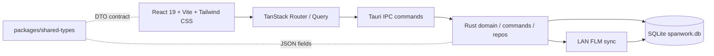

# Spanwork（跨度）

> 本地优先的长期项目管理桌面应用：把目标、习惯、时间记录和设备间同步放在一个安静可靠的工作台里。


## ✨ 项目亮点

- **本地优先**：数据写入本机嵌入式 SQLite，默认不依赖云端、数据库服务器或后台服务。
- **目标式项目**：任务树、里程碑任务、子任务、优先级、日期区间、看板/列表/日历多视图。
- **习惯式项目**：支持每日、每周、每月、每年规则，自动生成打卡实例，并保留 Fogg 行为设计字段。
- **时间闭环**：全局计时器、暂停/恢复/取消、手动补录、任务/习惯时间记录和今日累计。
- **今日工作台**：聚合活跃计时、今日习惯、最近任务、运行日志入口。
- **跨项目日历**：按日、周、月查看多项目习惯计划与执行情况。
- **局域网同步**：设备发现、配对码、双向同步、字段级合并（FLM）和同步历史。
- **类型契约统一**：`packages/shared-types` 输出前端、IPC 与 Rust DTO 对齐的 TypeScript 类型。

## 🧭 功能地图

| 模块 | 能力 |
|------|------|
| 今日 | 今日累计、活跃计时、今日习惯、最近任务、日志信息 |
| 项目 | 目标式 / 习惯式项目、分类、归档、删除、筛选、排序 |
| 任务 | 任务 CRUD、2 级子任务树、里程碑任务、批量完成、看板和日历视图 |
| 习惯 | 多规则习惯、周期计划、打卡状态、连续记录、行为设计字段 |
| 时间 | 全局计时器、任务/习惯计时、手动时间记录、分页历史 |
| 日历 | 跨项目日 / 周 / 月视图，支持项目过滤 |
| 同步 | 局域网发现、手动连接、配对码、FLM 增量同步、同步会话日志 |

## 🏗️ 技术架构



```text
.
├── apps/
│   └── spanwork/
│       ├── src/              # React UI、路由、组件、Tauri IPC client
│       ├── src-tauri/        # Rust 后端、SQLite migration、同步模块
│       └── GLOSSARY.md       # 产品概念、枚举、同步术语
├── packages/
│   └── shared-types/         # 前端共享 TypeScript DTO / 枚举 / 入参
├── Cargo.toml                # Rust workspace
├── package.json              # pnpm workspace 脚本
└── pnpm-workspace.yaml
```

## 🚀 快速开始

### 环境要求

- Node.js `>=22.13`
- pnpm `11.8.0`（见根目录 `packageManager`）
- Rust `1.88+`（见 `rust-toolchain.toml`）
- Tauri 2 原生依赖

Linux 可参考：

```bash
sudo apt-get install -y \
  build-essential pkg-config libssl-dev \
  libgtk-3-dev libwebkit2gtk-4.1-dev libjavascriptcoregtk-4.1-dev \
  libsoup-3.0-dev librsvg2-dev libayatana-appindicator3-dev
```

macOS 需要 Xcode Command Line Tools；Windows 需要 WebView2 与 Tauri 官方依赖。

### 安装与运行

```bash
pnpm install
pnpm tauri:dev
```

`pnpm tauri:dev` 会先释放 1420 / 1421 端口，再启动 Vite 与真实 Tauri 桌面壳。需要测试 SQLite、IPC、计时器、同步等后端能力时，请使用这个命令。

浏览器预览模式：

```bash
pnpm dev
```

`pnpm dev` 只启动 Vite，适合纯 UI 预览；此模式没有 Tauri IPC，后端数据功能不可用。

## 🧪 常用命令

| 命令 | 说明 |
|------|------|
| `pnpm tauri:dev` | 启动完整桌面应用（Vite 1420 + Tauri + SQLite） |
| `pnpm dev` | 启动浏览器预览（无 Tauri IPC） |
| `pnpm dev:kill-port` | 清理 1420 / 1421 端口 |
| `pnpm typecheck` / `pnpm check` | TypeScript project references 类型检查 |
| `pnpm --filter @spanwork/app test` | 运行前端 Vitest |
| `cargo build` | 构建 Rust workspace |
| `pnpm build` | 构建前端产物并运行类型检查 |
| `pnpm tauri:build` | 构建 Tauri 发布包 |
| `pnpm clean` | 清理 Rust、Vite、Tauri 与 TS 构建缓存 |

## 💾 数据与运行时

- 应用数据位于 Tauri 的 `app_data_dir`，数据库文件名为 `spanwork.db`。
- SQLite 启用 WAL 和外键约束，启动时自动执行 `apps/spanwork/src-tauri/migrations`。
- 首次启动会创建本机 `device_config`，用于本地设备身份与同步日志标记。
- 文件日志写入应用数据目录下的 `logs/`，可在应用的运行日志入口查看。

## 🔄 同步模型

Spanwork 的局域网同步采用 Field-Level Merge（FLM）：

1. 业务 repo 正常写入 SQLite。
2. SQLite trigger 自动记录 outbound 字段变更。
3. 同步会话基于 peer cursor 推送/拉取增量。
4. 对端按 registry 声明的表、列和 FK 顺序进行 skeleton insert 与列级 LWW 合并。

当前同步覆盖 8 张业务表：`project_categories`、`projects`、`tasks`、`habit_rules`、`milestones`、`habit_occurrences`、`milestone_links`、`time_entries`。详见 [`apps/spanwork/src-tauri/src/sync/README.md`](./apps/spanwork/src-tauri/src/sync/README.md)。

## 📚 参考文档

- [`apps/spanwork/GLOSSARY.md`](./apps/spanwork/GLOSSARY.md)：产品概念、枚举值、同步与工程术语。
- [`apps/spanwork/src-tauri/src/sync/README.md`](./apps/spanwork/src-tauri/src/sync/README.md)：FLM 同步模块开发与维护指南。
- `doc/`：本地设计文档目录，不纳入 git 提交。

## 🤝 开发约定

- 前端新增或变更 IPC 数据结构时，同步更新 `packages/shared-types`。
- Rust 新增可同步表/列时，同步更新 migration、repo、DTO 与 `sync/registry.rs`。
- 可同步业务表使用软删字段，不直接物理删除需要同步的实体。
- 运行完整业务链路时使用 `pnpm tauri:dev`，不要用浏览器预览验证后端行为。

---

**Spanwork** 的目标不是追踪更多事项，而是帮助长期项目持续前进。
