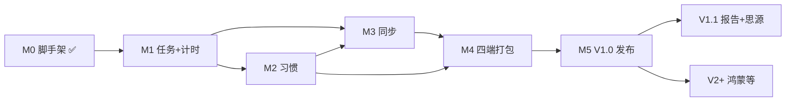

# Spanwork — 开发里程碑与实施计划

| 项目 | 说明 |
|------|------|
| 应用 | Spanwork（跨度） |
| 文档版本 | v1.0 |
| 创建日期 | 2026-06-22 |
| 关联文档 | [PRD v1.1](./PRD-v1.0-需求文档.md) · [ARCH v1.0](./ARCH-v1.0-架构设计.md) · [API v1.0](./API-v1.0-Tauri-Commands.md) |

---

## 1. 文档目的

本文档将 Spanwork 从 **M0 → V1 正式版 → V1.1 增强 → V2 扩展** 的开发工作拆解为可执行的里程碑，明确每阶段交付物、验收标准与预估工期，供个人迭代与 AI 辅助开发时对齐范围。

> 注意：下文 **M0、M1…** 指**工程开发里程碑**；产品内的 **Milestone（里程碑节点）** 指用户可在项目中手动设置的关键节点功能，在 **M1 末期 / M2** 交付。

---

## 2. 版本路线图总览

```
2026 Q2-Q3                          2026 Q4+              更远
──────────────────────────────────────────────────────────────────►

[M0 脚手架] → [M1 任务+计时] → [M2 习惯] → [M3 同步] → [M4 多端] → [M5 打磨]
     ✅              ▶ 当前重点
                                                          │
                                                     V1.0 发布
                                                               → [V1.1 报告+思源]
                                                               → [V2 鸿蒙/自动同步…]
```

| 版本 | 里程碑 | 目标一句话 | 预估工期 | 状态 |
|------|--------|------------|----------|------|
| — | **M0** | Monorepo + SQLite + 项目 CRUD + 基础 UI | 1 周 | ✅ 已完成 |
| **V1.0** | **M1** | 任务式项目 + 计时器 + 今日页 + 产品 Milestone | 2 周 | 🔲 待开始 |
| **V1.0** | **M2** | 习惯式项目 + 周期规则 + 习惯日历 | 2 周 | 🔲 |
| **V1.0** | **M3** | 局域网无主同步（mDNS + changeset） | 2–3 周 | 🔲 |
| **V1.0** | **M4** | macOS / Windows / Android / iOS 可构建运行 | 2 周 | 🔲 |
| **V1.0** | **M5** | 导出备份、冲突处理、体验与稳定性 | 1 周 | 🔲 |
| **V1.1** | — | 周报 / 年报 + 思源笔记联动 | 2–3 周 | 🔲 |
| **V2+** | — | HarmonyOS、后台同步、暗色主题切换等 | TBD | 🔲 |

**V1.0 合计预估**：约 **10–12 周**（个人兼职、含缓冲）

---

## 3. 当前进度（截至 2026-06-22）

### 3.1 M0 已完成项

| 类别 | 交付物 | 状态 |
|------|--------|------|
| 仓库 | pnpm monorepo（`apps/spanwork` + `packages/shared-types`） | ✅ |
| 壳 | Tauri 2 + React 19 + Vite + TanStack Router/Query | ✅ |
| UI | shadcn/ui + Tailwind v4，默认明亮主题 | ✅ |
| 数据库 | migration v1（全表 schema 预建） | ✅ |
| Rust API | `device_*` · `app_get_info` · `project_list/create/get` | ✅ |
| 前端 | 首页、项目列表、新建项目表单 | ✅ |
| 质量 | Rust 单元测试 2 项；`pnpm build` / `tauri:build` 通过 | ✅ |
| 工程 | pnpm 11 策略配置；`tauri:dev` 端口与 SQLite PRAGMA 修复 | ✅ |

### 3.2 M0 遗留 / 移入 M1

| 项 | 说明 |
|----|------|
| `project_update/delete` | API 文档已定义，实现延至 M1 |
| 项目详情页 | 仅有列表，无 `/projects/:id` 详情 |
| 今日页 | 路由存在占位，无计时/任务聚合 |
| cr-sqlite 集成 | schema 已建，扩展加载延至 M3 |

---

## 4. M1 — 任务式项目 + 时间记录 + 产品 Milestone

**工期**：2 周  
**目标**：完成任务型项目的核心闭环；用户可拆任务、记时、设里程碑；首页展示今日焦点。

### 4.1 交付物清单

| # | 交付物 | 类型 |
|---|--------|------|
| 1 | 任务 CRUD（含 2 级子任务） | Rust + UI |
| 2 | 项目详情页（任务树 + 概览） | UI |
| 3 | 全局计时器（start/stop/cancel） | Rust + UI |
| 4 | 时间记录手动补录 | Rust + UI |
| 5 | 产品 **Milestone** CRUD + 关联任务 | Rust + UI |
| 6 | 今日页 Dashboard（`today_get_dashboard`） | Rust + UI |
| 7 | `project_update` / `project_delete` / `project_reorder` | Rust |

### 4.2 Rust 任务分解

```
src-tauri/src/
├── commands/task.rs          # task_list/create/update/delete/reorder/batch_complete
├── commands/milestone.rs     # milestone_* + milestone_link_set
├── commands/time_entry.rs    # time_entry_*
├── commands/timer.rs         # timer_get_active/start/stop/cancel
├── commands/today.rs         # today_get_dashboard（或合入 project.rs）
├── db/repos/task.rs
├── db/repos/milestone.rs
├── db/repos/time_entry.rs
├── domain/task_tree.rs       # 级联软删除、完成度计算
└── timer/mod.rs              # ActiveTimer 内存态
```

**Tauri Commands（M1 新增）**：

| Command | 优先级 |
|---------|--------|
| `task_list` / `task_get` / `task_create` / `task_update` / `task_delete` | P0 |
| `task_reorder` / `task_batch_complete` | P1 |
| `milestone_list` / `milestone_create` / `milestone_update` / `milestone_delete` | P0 |
| `milestone_link_set` | P1 |
| `time_entry_list` / `time_entry_create` / `time_entry_update` / `time_entry_delete` | P0 |
| `timer_get_active` / `timer_start` / `timer_stop` / `timer_cancel` | P0 |
| `today_get_dashboard` | P0 |
| `project_update` / `project_delete` | P0 |

### 4.3 前端任务分解

```
src/
├── routes/projects/$projectId.tsx     # 项目详情
├── pages/ProjectDetailPage.tsx
├── components/task/TaskTree.tsx
├── components/task/TaskForm.tsx
├── components/milestone/MilestoneList.tsx
├── components/timer/TimerBar.tsx      # 全局悬浮/顶栏计时条
├── components/timer/TimeEntryForm.tsx
├── pages/TodayPage.tsx                # 替换 index 占位逻辑
└── lib/tauri/{task,milestone,time_entry,timer}.ts
```

### 4.4 验收标准

- [ ] 任务式项目下可创建 ≥2 级子任务，支持排序与状态流转
- [ ] 全局同时仅一个活跃计时器；停止后生成 `time_entry`
- [ ] 可手动补录时长（仅 duration 或起止时间）
- [ ] 项目内可创建 Milestone，可选关联任务
- [ ] 首页展示：活跃计时器、最近任务、今日时间汇总
- [ ] 全部 M1 Commands 有对应 UI 入口；错误 toast 可读
- [ ] Rust：`task_tree` + `timer` 相关单元测试 ≥4 个

### 4.5 建议周计划

| 周 | 重点 |
|----|------|
| W1 | Rust task/milestone repos + commands；项目详情页 + 任务树 UI |
| W2 | timer + time_entry；今日页；Milestone UI；联调与测试 |

---

## 5. M2 — 习惯式项目 + 周期规则

**工期**：2 周  
**目标**：支持每日/周/月/年习惯规则，自动生成实例，习惯日历与 Streak 统计。

### 5.1 交付物清单

| # | 交付物 |
|---|--------|
| 1 | `habit_rule_get/update` + 创建 habit 项目时绑定规则 |
| 2 | `habit_occurrence_ensure` 规则引擎（`domain/habit_schedule.rs`） |
| 3 | 习惯实例 CRUD + 改期 + 完成/跳过/未完成 |
| 4 | `habit_streak_get` |
| 5 | 项目详情页：习惯式 → 日历/列表视图 |
| 6 | 今日页：今日习惯待办 |

### 5.2 领域规则（须单测覆盖）

| 规则 | 说明 |
|------|------|
| daily | 每天一条 instance |
| weekly | `days_of_week` 指定周几 |
| monthly | `day_of_month` |
| yearly | `month_and_day`（MM-DD） |
| 过期 | `pending` → `missed`（打开项目或 ensure 时批量修正） |
| 补录 | 允许 `missed` → `done` |

### 5.3 验收标准

- [ ] 新建习惯式项目时可配置周期规则
- [ ] 打开项目或进入今日页时自动补齐未来 90 天实例（幂等）
- [ ] 习惯日历可标记完成/跳过；Streak 数字正确
- [ ] 习惯实例可关联 `time_entry`（复用 M1 能力）
- [ ] `habit_schedule` 单元测试：边界日期、闰年、月末

### 5.4 建议周计划

| 周 | 重点 |
|----|------|
| W1 | `habit_schedule` domain + repos + commands；ensure 逻辑 |
| W2 | 习惯 UI（日历简版 + 列表）；今日页习惯区；Streak |

---

## 6. M3 — 局域网无主同步

**工期**：2–3 周  
**目标**：同 Wi‑Fi 下手动触发双设备数据 merge，无第三方服务器。

### 6.1 交付物清单

| # | 交付物 |
|---|--------|
| 1 | cr-sqlite 扩展加载 + CRR 表注册 POC |
| 2 | `sync/discovery.rs` — mDNS `_spanwork._tcp.local` |
| 3 | `sync/protocol.rs` + `sync/session.rs` — TCP 帧与状态机 |
| 4 | `sync/merge.rs` — changeset 推拉 |
| 5 | 配对码流程（6 位，5 分钟有效） |
| 6 | 设置页 `/settings/sync` — 发现、配对、进度、历史 |
| 7 | 手动 IP:端口连接备选 |

### 6.2 Commands

| Command | 说明 |
|---------|------|
| `sync_discovery_start/stop` | mDNS |
| `sync_pairing_request` | 配对 |
| `sync_start` | 双向同步 |
| `sync_connect_manual` | 手动 IP |
| `sync_history_list` | 日志 |
| `sync_get_peer_cursors` | 游标 |

Events：`sync://discovered` · `sync://progress` · `sync://completed`

### 6.3 验收标准

- [ ] 两台 Mac（或 Mac + 模拟器）同 LAN 可互相发现
- [ ] 配对成功后，A 创建项目，B 同步后可见
- [ ] 双端同时改不同字段可自动 merge（cr-sqlite）
- [ ] 同步失败有明确错误；`sync_session_log` 有记录
- [ ] 活跃计时器**不同步**（文档行为一致）
- [ ] 集成测试：协议握手 + 小 changeset 往返

### 6.4 风险缓冲

- **Week 1**：cr-sqlite POC；若阻塞，降级 LWW（`updated_at` + `device_id`）且协议不变
- **Week 2–3**：完整 UI + 双机实测

---

## 7. M4 — 四端打包与发布准备

**工期**：2 周  
**目标**：Android、macOS、iOS、Windows 均可构建；Alpha → Beta 顺序发布。

### 7.1 平台顺序

| 顺序 | 平台 | 动作 |
|------|------|------|
| 1 | macOS | 签名、notarization（可选）、`.dmg` |
| 2 | Windows | `.msi` / NSIS，WebView2 说明 |
| 3 | Android | `tauri android build`，真机调试 |
| 4 | iOS | 开发者账号、TestFlight |

### 7.2 交付物

| # | 交付物 |
|---|--------|
| 1 | CI 脚本草案（GitHub Actions 或本地文档） |
| 2 | 各平台构建说明写入 README |
| 3 | 应用图标与元数据统一 |
| 4 | 移动端响应式 UI 走查（侧栏 → 底栏/抽屉） |
| 5 | Tauri capabilities 按平台最小权限审查 |

### 7.3 验收标准

- [ ] 四端 `tauri build` / `android build` / `ios build` 文档化且本地可复现
- [ ] 核心流程在四端 smoke test 通过（项目 CRUD + 计时 + 同步至少桌面+Android）
- [ ] 冷启动 < 3s（中端 Android 可放宽至 5s 并记录）

---

## 8. M5 — V1.0 打磨与发布

**工期**：1 周  
**目标**：达到 PRD V1 成功标准，可日常自用。

### 8.1 交付物

| # | 交付物 |
|---|--------|
| 1 | `export_json` / `export_db_backup` / `import_json` |
| 2 | 设置页：设备名、数据导出 |
| 3 | 同步冲突简版提示（count + 日志） |
| 4 | 空状态、错误态、Loading 统一 |
| 5 | 已知问题清单 + V1.0 tag |

### 8.2 V1.0 发布检查表（摘自 PRD）

- [ ] 任务式 / 习惯式项目 CRUD
- [ ] 子任务 ≥2 级
- [ ] 产品 Milestone 手动管理
- [ ] 计时器 + 事后补录
- [ ] 本地 SQLite + 导出
- [ ] 局域网手动同步
- [ ] Android、macOS、iOS、Windows 可运行

---

## 9. V1.1 — 报告与思源联动

**工期**：2–3 周（V1.0 之后）

| 模块 | 内容 | 优先级 |
|------|------|--------|
| 报告 | 周报、年报生成（**不含月报**） | P0 |
| 报告 UI | 预览 Markdown、历史列表、导出 | P0 |
| 思源 | `siyuan_test_connection`、报告写入块 | P1 |
| 思源 | 项目进度块手动同步 | P2 |
| 设置 | 周报起始日、思源 Token（Keychain） | P1 |

**建议顺序**：先做周报 → 年报 → 思源报告写入 → 其他联动。

---

## 10. V2+ — 远期里程碑（草案）

| 里程碑 | 内容 | 触发条件 |
|--------|------|----------|
| V2.0 | HarmonyOS（Flutter 壳或 ArkUI 简版） | 四端稳定后 |
| V2.1 | 后台 LAN 自动同步（可选） | 用户痛点明确 |
| V2.2 | 暗色主题切换 | UI 稳定后 |
| V2.3 | 同步 E2E 加密、固定设备密钥 | 安全需求 |
| V2.4 | 任务依赖、甘特图 | 非必需，低优先级 |

---

## 11. 依赖关系



**可并行建议**（个人开发仍建议串行）：

- M2 与 M3 前期（cr-sqlite POC）可重叠
- M4 平台打包可在 M3 稳定前先做 macOS/Win

---

## 12. 每个里程碑的 Definition of Done

| 检查项 | 说明 |
|--------|------|
| 代码 | 合并到 main，无阻塞性 lint/编译错误 |
| 测试 | 本阶段新增 Rust 单测通过；`pnpm build` 通过 |
| 文档 | API 文档与实现一致（有变更则更新 `API-v1.0`） |
| 手动验证 | 按验收标准走查一遍并记录 |
| 版本 | 里程碑完成打 git tag（可选）：`m1`、`v1.0.0` 等 |

---

## 13. 个人开发节奏建议

假设 **每周可投入 10–15 小时**：

| 日历 | 里程碑 | 累计 |
|------|--------|------|
| 2026-06 W4 | M0 收尾 ✅ + M1 启动 | — |
| 2026-07 W1–W2 | M1 | +2 周 |
| 2026-07 W3 – 08 W1 | M2 | +2 周 |
| 2026-08 W2–W4 | M3 | +3 周 |
| 2026-09 W1–W2 | M4 | +2 周 |
| 2026-09 W3 | M5 → **V1.0** | +1 周 |
| 2026-10+ | V1.1 | +2–3 周 |

**目标 V1.0 日期**：约 **2026-09 下旬**（可随实际进度调整）

---

## 14. 与产品「Milestone」功能的对应

| 工程里程碑 | 产品功能 Milestone |
|------------|-------------------|
| M0 | 数据库 `milestones` 表已建，无 UI |
| **M1** | **用户可在项目内创建/完成 Milestone，关联任务** |
| M2 | 习惯项目 Milestone 可关联习惯实例（`milestone_links`） |
| V1.1 | 报告中含 Milestone 进展；可选同步到思源块 |

---

## 15. 修订记录

| 版本 | 日期 | 变更 |
|------|------|------|
| v1.0 | 2026-06-22 | 初稿：M0–V2 里程碑、任务分解、验收标准、日历 |

---

*实施过程中若范围变更，请同步更新本文档与 [PRD v1.1](./PRD-v1.0-需求文档.md) 第 8 节。*
